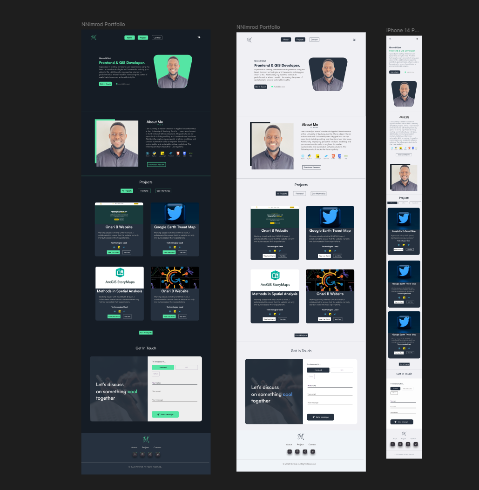

# Portfolio Web – Projet Final

## Présentation

Ce projet correspond à l’intégration d’un **portfolio web personnel**, réalisé dans le cadre du module **2FCSS – Frameworks CSS**.

L’objectif est de proposer un site **moderne, responsive, accessible et professionnel**, en respectant fidèlement une **maquette Figma** choisie dans la communauté officielle.

---

## Objectifs du projet

* Intégrer un portfolio web à partir d’une maquette Figma (pixel-perfect)
* Utiliser un **framework CSS** vu en cours
* Proposer un site :

  * Responsive (mobile, tablette, desktop)
  * Accessible
  * Clair et structuré
* Mettre en ligne le projet (GitHub Pages / Netlify)

---

## Maquette Figma

* Maquette utilisée :
  **Lien Figma :** https://www.figma.com/design/cAAcnkuswVtXpdi5PX567z/Designer-Developer-Portfolio--Community-?node-id=1-263&t=wjDBUz7LRo7TJ1bD-0

* Aperçu de la maquette :

  

---

##  Contenu du portfolio

Le site est composé des sections suivantes :

* **Accueil**
  Présentation visuelle et introduction

* **À propos**
  Présentation du profil, du parcours et des objectifs

* **Compétences**
  Mise en avant des compétences techniques à l’aide d’éléments visuels (cards, badges, icônes, etc.)

* **Projets**
  Présentation d’au moins **2 projets** (réels ou fictifs)

* **Contact**
  Formulaire de contact avec :

  * Nom
  * Prénom
  * Email
  * Objet
  * Message
    Validation des champs côté **front-end uniquement**

---

## Responsive Design

Le portfolio est entièrement responsive et optimisé pour :

* Smartphone
* Tablette
* Ordinateur portable
* Écran desktop

Aucun scroll horizontal et adaptation fluide selon la taille d’écran.

---

## Technologies utilisées

* **HTML5** (structure sémantique)
* **CSS / Framework CSS** : *Bootstrap*
* **JavaScript Vanilla**
* **Outils** :

  * Figma
  * Git & GitHub
  * VsCode

---

## Installation et lancement en local

1. Cloner le dépôt :

   ```bash
   git clone https://github.com/clem465/Portfolio.git
   ```

2. Ouvrir le projet :

   ```bash
   cd Portfolio
   ```

3. Lancer le fichier `index.html` dans un navigateur

---

## Déploiement

* **Site en ligne :** *https://clem465.github.io/Portfolio/*
* **Dépôt GitHub :** *[https://github.com/clem465/Portfolio](https://github.com/clem465/Portfolio)*

---

## 📸 Aperçu du projet


---

## Auteur

* **Nom Prénom** : *HUBERT Clément*
* Email : *clement.hubert78@gmail.com*
* LinkedIn : *https://www.linkedin.com/in/cl%C3%A9ment-hubert-b6776034b/*

---

## Remarques

Ce projet a été réalisé dans un cadre pédagogique et respecte les consignes suivantes :

* Travail individuel
* Respect de la maquette
* Code propre et lisible
* Bonnes pratiques d’accessibilité
* Déploiement en ligne fonctionnel

---

Merci pour votre visite


